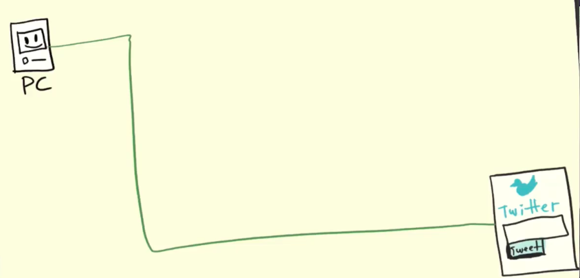
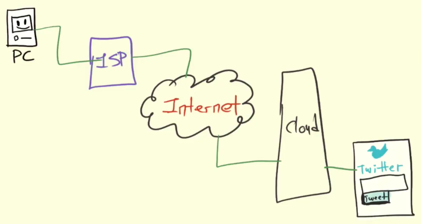
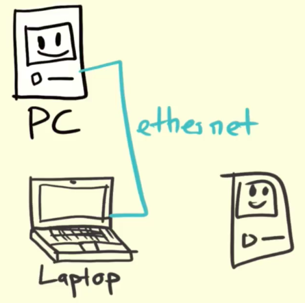
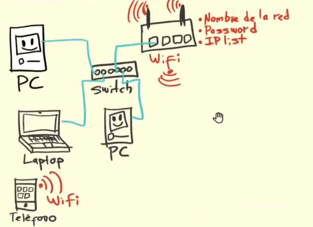
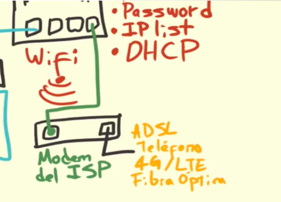

# Introducción a las redes, protocolos e Internet
Keywords:

* switch: cambiar :Un switch es un dispositivo que sirve para conectar varios elementos dentro de una red.
* router:Enrutador=permite que varias redes u ordenadores se conecten entre sí
* Lista de IP= EXAMINA NUESTRA LISTA verificada de PROXY para privacidad en línea
* DHCP:---- Dynamic Host Configuration Protocol = protocolo de configuración huésped dinámico
* Dirección MAC:= identificador único que se les asigna a las interfaces de redes
* Módem:es un dispositivo que convierte las señales digitales en analógicas …

Esto es lo que usualmente creemos que pasa:

luego nos acordamos que existen otros pasos que son 

* computador  
* proveedor de internet 
* internet 
* servidores o clud 
* twitter 

pero todo esto no funciona del todo asi:

primero hablaremos como se conecta un computador a una red local

esto es como se conectariar dos ordenadores a internet entre si por medio de un cable ethernet pero de alli nace un proble conectar a un tercero seria imposible o tendria que tener otro puerto ethernet

Por ello empezaron a aparecer formas mas simples de conectarce a internet entre ellas una llamada

 **switch:** es un aparato donde se conectan todos los dispositivos; el switch con un algoritmo muy sensillo encricta el menaje enviado de un computador a otro 

 luengo nacen lo router
 que pueden funcionar como un switch pero son mas inteligentes que quiere decir esto:
 tiene un software especial
 donde el necesita saber varias cosas.

 *nombre de la red
 * contraseña de la red
 * lista de IP

 

 * la IP es un numero especia que identifica a todos los computadores en la red 
* los router pueden o no terner wifi
* la parte encargada de crear la ip y donde biene ralmente la conexion se llama DHCP

ENTONCES los pasos son 

**computador** oye quiero conectarme a internet **switch** dejame ver que dispositivos tengo conectados y buscare en router **router** en mi lista yo te recuerdo a ti computador por tus especificasiondes de haware entonces de la ip te voy ba signar una ip unica conla cual tu vas aconectarte a esta red local

la mac address la tiene todos lo comunicadores de red entre ellos los computadores donde la mac address viene quemada en el haware y no es por computador es por interfas de red

* es un numero muy largo que identifica a cada pieza de comunicacion que se conecta a una red  publica 
 *  wifi
 *bluetooth
 *señal de radio 
 *computador

*los haker fingen ser otro dispositivo cuando en realidad son ellois mismos*

luego viene el **moden del ISP internet servise porbaider** que va conestado al router 

hay muchas formas en las que que se puede conectar  a internet 

* ADSL
* cable de telefono
* 4g/LTE
* FIBRA OPTICA

 

 En redes viejitas donde solo había un switch las ip’s se asignaban manual o se tenía un servidor que las asignaba automáticamente conocido como servidor DHCP (Dynamic Host Configuration Protocol)

Hoy en día la mayoría de los proveedores de internet nos dan un Hardware que al mismo tiempo es un switch (pues puedes conectarte por cable) un Router (pues te conectas por wifi y nos asigna una IP) y nos provee de internet.