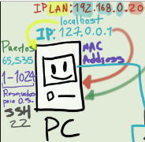

# Puertos y protocolos de red

Un puerto de red es una interfaz para comunicarse con un programa a través de una red.
Suele estar numerado para de esta forma poder identificar la aplicación que lo usa

Como funcionan y cuales son las direcciones IP, quien las asigna a nivel publico y como los router a través de DHCP asignan las privadas.
Cuantos rangos de ip tenemos disponibles y mencionan algunos puertos y para que se usan.

## ip
internet protocole es una serie de numero que identifica aun computador

un computador tiene nultiples direcciones IP 

* una es la ip de internet ella es global
* otra es la IP local que la define el router los routers son las puertas de enlase a diferentes redes utilizando el protocolo DHCP decide por donde entregarnos la direccion IP

127.0.0.1  Es una ip que siempre va aputar al dispositivo que este utilizando localhost

IP LAN local area network  es la IP donde estan todos mis dispositivos ejemplo 192.168.0.20 y es impartida por el router dependiendo de la llegada del dispositivo le asigna una ip cambiando el ultimo BYTE de la IP LAN

la IP lOCAL y  la  IP LAN siempre van a apuntar al mismo computador

IP’s que dirigen a nuestro pc:
127.0.0.1
192.168.0.3 (Ip de LAN )
localhost (host)
Puertos: Redes virtual dentro del SO
Se puede hacer una analogía con los cables y pines, por lo que enviamos información en un circuito. En un SO funcionan los puertos
Del 1 al 1024 (llamados bien conocidos) están reservados para ser ejecutados por el SO a través del admin.
Ejemplos:
1 - Protocolo HTTP => Puerto 80
2 - Protocolo HTTPS => Puerto 443
Del 1024 al 49151 son los puertos registrados, los cuales puede usar cualquier aplicación
Ejemplo:
1 - Bittorrent => Puertos del 6881 al 6889
Los puertos del 49151 al 65535 son llamados dinámicos o privados y son aquellos que se asignan dinámicamente a alguna aplicación del cliente, cuando inicia una conexión.
Ejemplos: Son usados por los servicios P2P (peer to peer)

mas que estandar es una convension para separar las IPs en publicas o privadas
Las Ip privadas que es lo que mas comunmente estan restrinjidas para el uso exclusivos de IP privadas… estan son:
10.0.0.0 hasta la 10.255.255.255
127.0.0.0 hasta la 127.255.255.255 y esta es solo para LOOPBACK
172.16.0.0 hasta la 172.31.255.255
192.168.0.0 hasta la 192.168.255.255
cualquier ip que este fuera de estos cuatro rangos se le considera una IP pública.

Las direcciones ip estan clasificadas como clase A, clase B, clase C, D y E
Esta clasificación es mas que todo para las IPv4

un byte son 8 bits si tu tienes el valor 11111111 es igual a 255 por consiguiente dos bytes puede ser 256 (si incluimos el 0) por 256
256 * 256 = 65.536
Ahora restamos 1 por el puerto 0, porque no es valido y obtenemos los 65.535

realmente como cuando tenemos un chip con cables el cual trasmite informacion en los esquemas de  red se crea una red virtual dentro de los sitemas operativos con un cosepto interno que sele conoce como los 
* **PUERTOS** los puertos tienen numeros hasta el BYTE mas alto que sea posible con dos bytes

255*255 = 65.535 puertos disponibles

y cada puerto tiene funcionamientos diferentes y son distribuidos por el S.O atravez de los anillos kernel driver delicados drives accesibles y app hay una clas ede puertos cerrados por defecto que son del uno al 1024 que pueden ser accedidos atraves del administrador

y ahy muchos protocolos para estos puertos 

servido que se conecta al internet atraves de navegador http y su puerto es el puerto 80 

Protocolos:
HTTP: 80
BITTORRENT: 6881-6889
HTTPS: 443 protocolo sifrado seguro
SSH:  22 

 