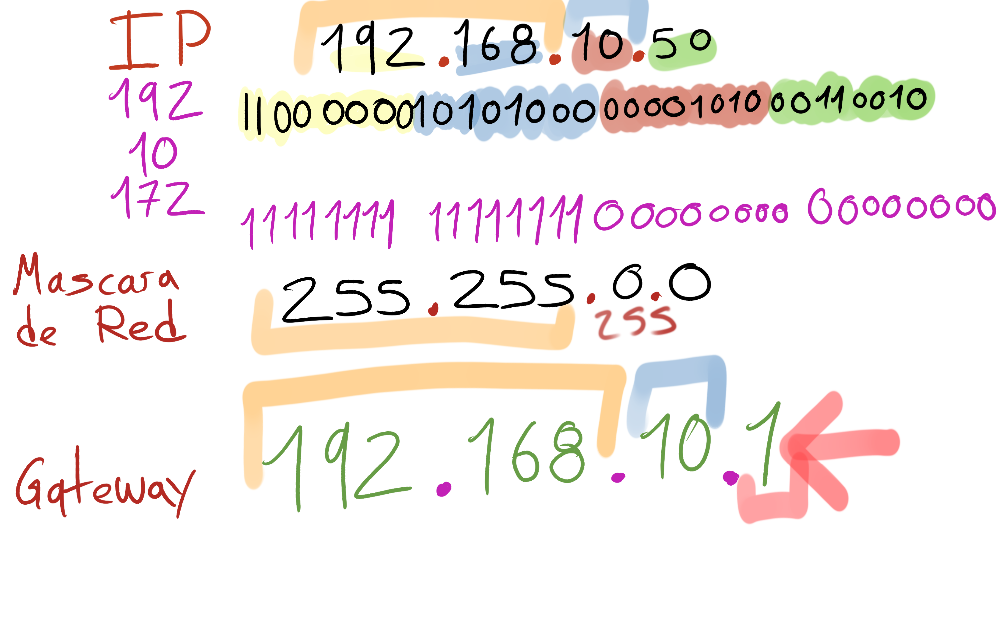

# Qué es una dirección IP y el protocolo de Internet
Mascara de red
255 255.0.0 nos dice cuales los los numeros de la IP que no pueden cambiar y cuales son los que si pueden cambiar en una red local

para yo poder conectarme a twitter desde mi pc tengo que poder saber que esa IP equivale a internet y mi pc conectandise al router y al moden ISP tendre una IP publica osea que es vista desde cualquier parte del planeta

y tengo una IP interna apra identificar todos mi dispositivos de una red local

la manera mas facil de ver si una ip es clase A, B o C es utilizando la mascara de red estandar y estas son:
255.0.0.0 - clase A
255.255.0.0 - clase B
255.255.255.0 - clase C
Pero, tambien existe el metodo de mascara de subred variable, la cual es muy util para segmentar una red ip con mascara de red estandar

todo seccion representada por un 0 en la mascara de red va a ser destinada a host o clientes y las que estan representadas por 255 son la destinada a la red

IP: es la sigla de Internet Protocol y una dirección IP es un número único con el cual una computadora o un dispositivo se identifica cuando está conectada a una red con el protocolo IP.

Cada dirección IP está compuesta por 4 números separados por puntos y son una forma de comprender números más grandes y complejos. Las direcciones IP tienen una estructura que las convierten en privadas o públicas y que además hacen parte de la máscara de red y el getaway.

Las direcciones IP permiten que cada computador o dispositivo pueda conectarse al exterior, es decir a Internet, esto a través de tecnologías como NAT o Network Address Translation.

Mascara de red: La máscara de red o redes es una combinación de bits que sirve para delimitar el ámbito de una red de ordenadores.1 Su función es indicar a los dispositivos qué parte de la dirección IP es el número de la red, incluyendo la subred, y qué parte es la correspondiente al host. Mediante la máscara de red, un sistema (ordenador, puerta de enlace, router, etc…) podrá saber si debe enviar un paquete dentro o fuera de la subred en la que está conectado. Por ejemplo, si el router tiene la dirección IP 192.168.1.1 y máscara de red 255.255.255.0, entiende que todo lo que se envía a una dirección IP con formato 192.168.1.X, se envía hacia la red local, mientras que direcciones con distinto formato de direcciones IP serán buscadas hacia afuera (internet, otra red local mayor, etc…).

Gateway: La pasarela (en inglés *gateway* ) o puerta de enlace es el dispositivo que actúa de interfaz de conexión entre aparatos o dispositivos, y también posibilita compartir recursos entre dos o más computadoras.

cuando escribes el nombre de la red wifi corecto y la contraseña el router wif le emite un paquete de coneccion y parte del paquete de connecion es decirle oiga el gateway tiene esta IP.
La IP de gateway el IP del router principal que se conecta al resto de los computadores de mi red y "afuera" osea internet

La IP del ROUTER no es necesariamente es la misma del Model el model es el que se conecta a internet y este se conecta al Router pormedio de un protocolo llamado **NAT** NETWORK ADDRESS TRANSLECION que es un protocolo que traduce las IP de internet a las IP locales

pero lo mas  Importante es el que la IP de nuestro ROUTER tiene la IP de 192.168.0.1 y ese es el conocido gatewayIP una vez el computador tiene el gatewayIP correcto puede hacer de HCP optener un IP parsarla por el protocolo NAT y conectarce a internet atravez del moden ISP

Su propósito es traducir la información del protocolo utilizado en una red inicial, al protocolo usado en la red de destino.

La pasarela es normalmente un equipo informático configurado para dotar a las máquinas de una red de área local (Local Area Network, LAN) conectadas a él de un acceso hacia una red exterior, generalmente realizando para ello operaciones de traducción de direcciones de red(Network Address Translation, NAT). Esta capacidad de traducción de direcciones permite aplicar una técnica llamada “enmascaramiento de IP” (IP Masquerading), usada muy a menudo para dar acceso a Internet a los equipos de una LAN compartiendo una única conexión a Internet, y por tanto, una única dirección IPexterna. v 

NAT: La traducción de direcciones de red o NAT (del inglés Network Address Translation) es un mecanismo utilizado por routers IP para intercambiar paquetes entre dos redes que asignan mutuamente direcciones incompatibles. Consiste en convertir, en tiempo real, las direcciones utilizadas en los paquetes transportados. También es necesario editar los paquetes para permitir la operación de protocolos que incluyen información de direcciones dentro de la conversación del protocolo.

